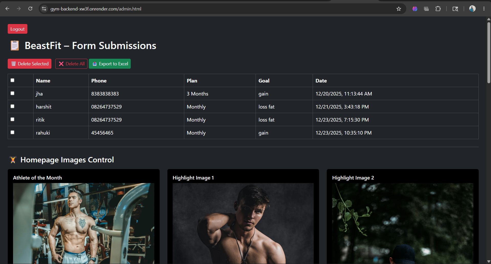

# 🏋️ BEASTFIT – Premium Gym & Fitness Platform

A responsive gym and fitness platform built with Node.js and Express.js, focused on lead generation, admin management, pricing control, and responsive user experience.

---

## ✨ Features

- Admin authentication and dashboard management
- Contact form submission handling
- Dynamic pricing and homepage content management
- Image upload and media handling
- Excel export for gym inquiries and submissions
- Responsive backend integration for frontend operations

---

## 📸 Screenshots

### Homepage Interface


### Admin Dashboard



### Mobile Responsive View


---

## 🛠️ Tech Stack

- Node.js
- Express.js
- Multer
- XLSX
- Express-Session
- CORS
- Body-Parser

---

## 📦 Installation

```bash
git clone <your-repo-url>
cd gym-backend
npm install
npm start
```

The server will start on:

```bash
http://localhost:5000
```

---

## 📁 Project Structure

```bash
gym-backend/
├── public/
├── private/
├── data/
├── uploads/
├── server.js
├── package.json
└── README.md
```

---

## ⚙️ Environment Variables

```env
PORT=5000
NODE_ENV=development
ADMIN_USERNAME=admin
ADMIN_PASSWORD=your_password_here
SESSION_SECRET=your_secret_key
```

---

## 📤 Deployment

This project can be deployed on platforms like Render, Heroku, or other Node.js hosting services.

---

## 🚧 Ongoing Improvements

This project is actively being improved with a focus on performance optimization, better admin management, improved responsiveness, and enhanced backend scalability.

Planned improvements include:

- Better authentication system
- Improved dashboard experience
- Backend optimization
- Enhanced security handling
- Better media management

---

## 📄 License

This project is licensed under the ISC License.
